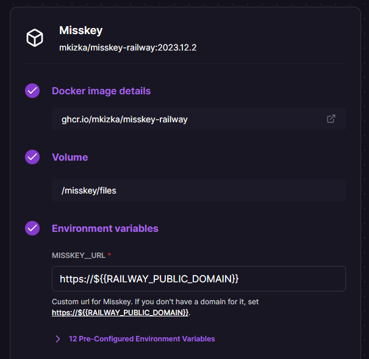
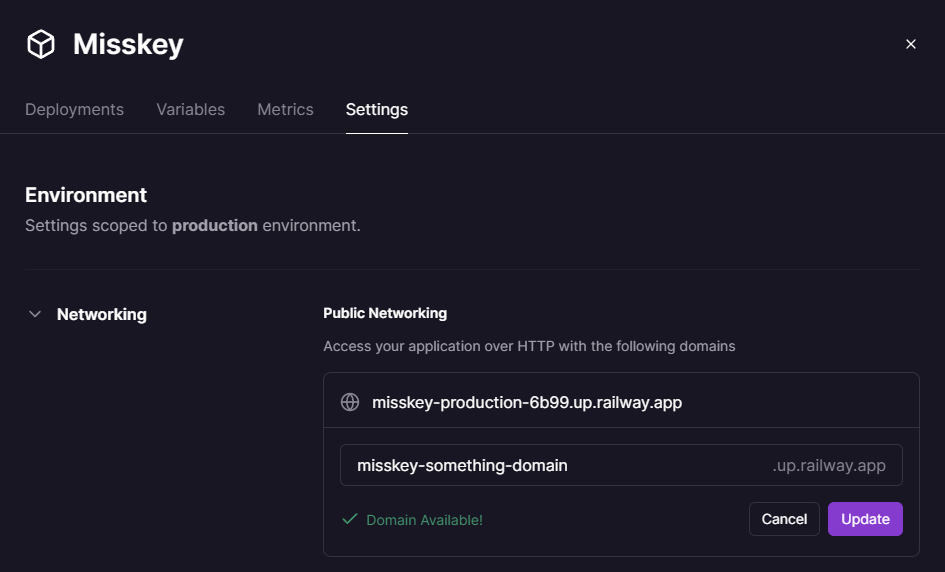
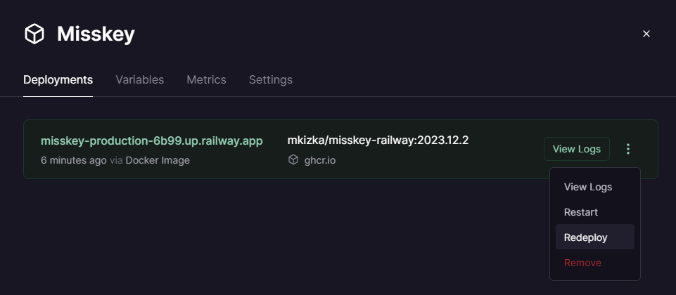
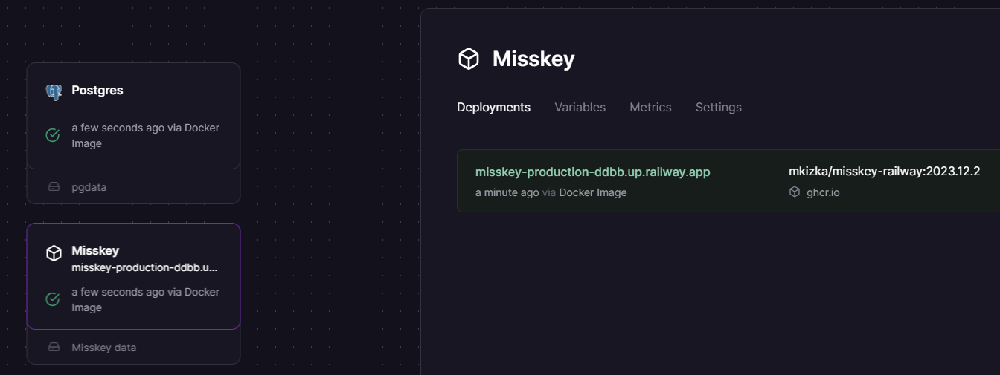
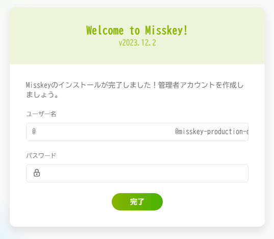
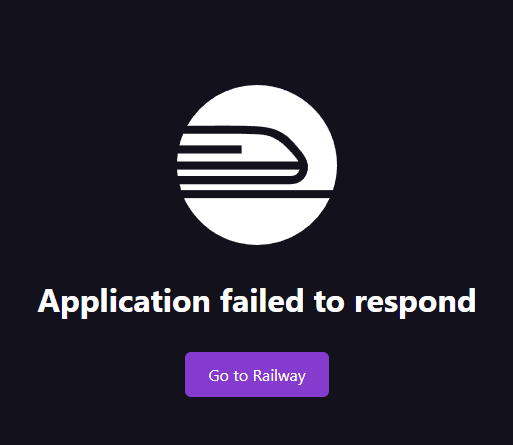

[English](./README.md) | [日本語](./README_ja.md)

# misskey-railway-template

This is a template for deploying Misskey on [Railway](https://railway.app).

**Note: This template only works with the Hobby plan or higher.**


## How to Use

### 1. Click on 'Deploy on Railway'

[](https://railway.app/template/8bBGvg?referralCode=mveF9L)

### 2. Set Environment Variables



Set the environment variables as needed. If there is nothing you want to change, you don't need to do anything.

<details>
<summary>For those who want to change settings</summary>
Misskey uses a yml file for configuration, but this template allows the use of environment variables with a custom Docker image.

In this Docker image, a yml file is generated at container startup based on the environment variables prefixed with `MISSKEY`.

Example:

```
MISSKEY__DB__USER=db-user
MISSKEY__DB__PASS=db-pass
```

↓

```yml
db:
  user: db-user
  pass: db-pass
```

For detailed rules of the conversion, refer to [read-env's README](https://github.com/yatki/read-env), and for more information on each setting of Misskey, refer to [Misskey's .config/example.yml](https://github.com/misskey-dev/misskey/blob/9eae82de1d4f9157602451e26e734c8f4ae94bea/.config/example.yml).

</details>

### 3. Click 'Deploy'

Deployment starts.

### 4. Set Up a Domain (Optional)

You can set up a domain from the "Settings". You can use a free domain from Railway, or your own custom domain.



After setting the domain, be sure to click "Redeploy".



### 5. A Few Minutes Later, Click on the 'Misskey' Service and Access the URL

The URL will be displayed in the 'Deployments' section as shown below.



That's it!



## Troubleshooting



You may encounter a message like this.

- Try waiting a bit and then reload
- Redeploy

These actions can sometimes resolve the issue.

## ⚠️⚠️Caution⚠️⚠️

- After starting to use Misskey, please do not change the domain.
- Uploaded images are stored in the mounted volume. The volume capacity is 5GB, so it is recommended to set up S3 or similar from the start if needed.
- Railway charges based on usage, so please do not increase your followers excessively. [You can also set limits on usage from the settings.](https://docs.railway.app/reference/usage-limits)

## Icon

The icon is copied from [misskey-dev/assets](https://github.com/misskey-dev/assets/blob/81499387376c00cf7d287a179d15ba2988b5c7eb/public/icon.png).
