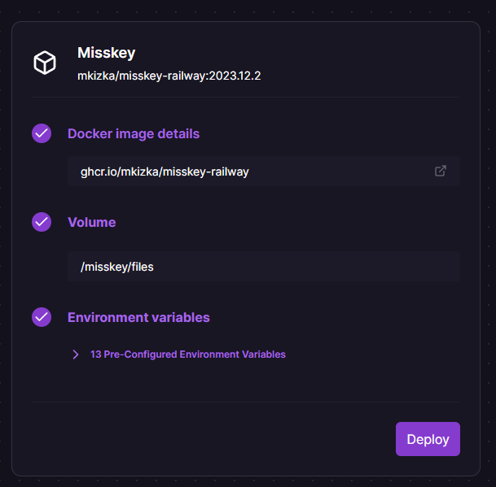
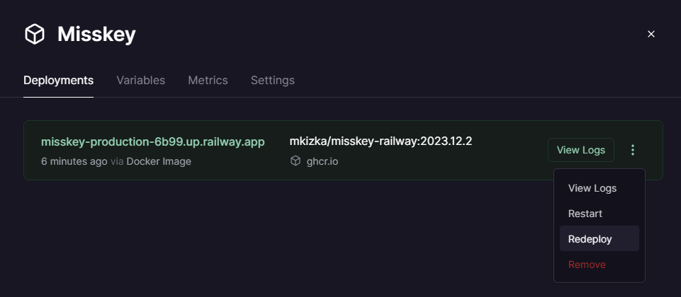
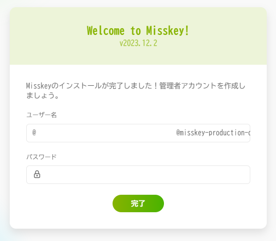

[English](./README.md) | [日本語](./README_ja.md)

# misskey-railway-template
[Railway](https://railway.app)でMisskeyをデプロイするためのテンプレートです。

## 使用方法

### 1. Deploy on Railwayをクリック

[](https://railway.app/template/8bBGvg?referralCode=mveF9L)

### 2. 環境変数を設定


必要に応じて環境変数を設定します。もし変更したいものが無ければ、何もする必要はありません。

<details>
<summary>変更したい方向け</summary>

Misskeyはymlファイルを使って設定を行いますが、このテンプレートでは環境変数が使用できるカスタムされたDockerイメージを使います。

このDockerイメージでは、コンテナ起動時に先頭に`MISSKEY`とついた環境変数の内容に応じてymlファイルが生成されます。

例：

```
MISSKEY__DB__USER=db-user
MISSKEY__DB__PASS=db-pass
```
↓
```yml
db:
  user: db-user
  pass: db-pass
```

変換の詳細な規則については[read-envのREADME](https://github.com/yatki/read-env)を、Misskeyの各設定について詳しくは[Misskeyの.config/example.yml](https://github.com/misskey-dev/misskey/blob/9eae82de1d4f9157602451e26e734c8f4ae94bea/.config/example.yml)を参照してください。
</details>

### 3.「Deploy」をクリック
デプロイが始まります。

### 4. ドメインを設定する(任意)
「Settings」からドメインを設定できます。Railwayの無料ドメインか、あなたが持っているカスタムドメインを使用できます。


ドメインをセットした後、必ず「Redeploy」をクリックしてください。



### 5. 数分後、「Misskey」サービスをクリックしてURLにアクセス
以下のような画面の「Deployments」にURLが表示されています。


以上で完了です！



## ⚠️⚠️注意⚠️⚠️
- Misskeyを使い始めた後、ドメインを変更しないでください。
- アップロードした画像はマウントされたボリュームに保存されます。ボリュームの容量は5GBのため、必要に応じてS3などを最初から設定しておくことをおすすめします。
- Railwayは使用量に応じて課金されるため、フォローを増やしすぎないでください。[設定から使用量を制限することも出来ます。](https://docs.railway.app/reference/usage-limits)
